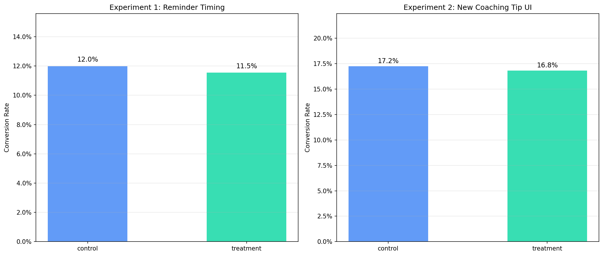
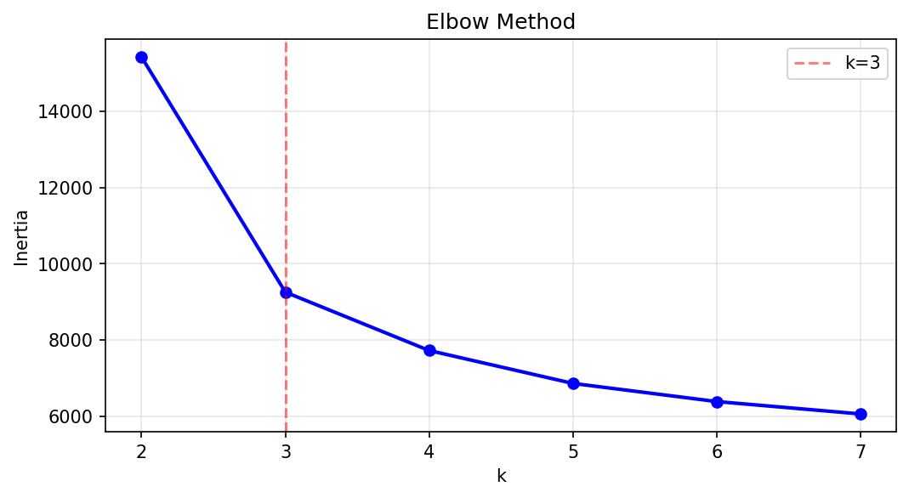
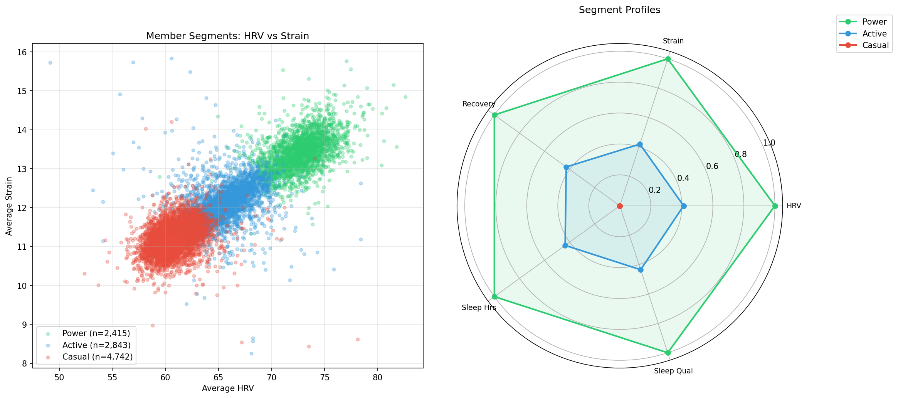

# Experimentation & Segmentation

**[Live Interactive Dashboard](https://nicholasjh-work.github.io/feature-adoption-retention/)**

A/B test analysis framework and behavioral user segmentation for a wearable health platform. Uses statistical testing (Welch's t-test, Cohen's d, confidence intervals) and K-Means clustering on health KPIs.

## Quick Start

```bash
git clone https://github.com/nicholasjh-work/Experimentation-segmentation.git
cd Experimentation-segmentation
pip install -r requirements.txt

# Requires infra-data-pipelines demo to have run first (PostgreSQL loaded)
python demo.py
```

The demo runs tests, analyzes A/B experiments, segments users, and generates all charts.

## Demo Output

### A/B Test Results



```
Experiment 1: Reminder Timing
    control       4,978 participants   597 converters   12.0% conv rate
    treatment     5,022 participants   580 converters   11.5% conv rate
    Decision:  Iterate (p=0.164)

Experiment 2: New Coaching Tip UI
    control       4,951 participants   854 converters   17.2% conv rate
    treatment     5,049 participants   849 converters   16.8% conv rate
    Decision:  Iterate (p=0.969)
```

### K-Means Segmentation





```
Segment Profiles:
  Power    (n=2,412):  HRV=72.6  Strain=13.4  Recovery=77.3  Sleep=7.4h
  Active   (n=2,835):  HRV=65.7  Strain=12.1  Recovery=70.5  Sleep=7.0h
  Casual   (n=4,753):  HRV=60.8  Strain=11.2  Recovery=65.4  Sleep=6.8h
```

### Test Suite (10/10 passing)

```
tests/test_experiment_analyzer.py::TestEqualDistributions::test_same_normal          PASSED
tests/test_experiment_analyzer.py::TestEqualDistributions::test_ci_contains_zero     PASSED
tests/test_experiment_analyzer.py::TestDifferentDistributions::test_large_effect      PASSED
tests/test_experiment_analyzer.py::TestDifferentDistributions::test_effect_size_positive PASSED
tests/test_experiment_analyzer.py::TestDifferentDistributions::test_ci_excludes_zero  PASSED
tests/test_experiment_analyzer.py::TestUnderpowered::test_small_sample_iterates      PASSED
tests/test_experiment_analyzer.py::TestResultShape::test_result_is_dataclass          PASSED
tests/test_experiment_analyzer.py::TestInputValidation::test_too_few_observations     PASSED
tests/test_experiment_analyzer.py::TestInputValidation::test_empty_raises             PASSED
tests/test_experiment_analyzer.py::TestInputValidation::test_custom_alpha             PASSED
```

## ExperimentAnalyzer API

```python
from analysis.experiment_analyzer import ExperimentAnalyzer

analyzer = ExperimentAnalyzer(alpha=0.05)
result = analyzer.analyze(control_values, treatment_values)

result.decision        # "Ship" or "Iterate"
result.p_value         # 0.0023
result.cohen_d         # 0.42
result.ci_low          # 1.23
result.ci_high         # 4.87
result.control_mean    # 50.1
result.treatment_mean  # 53.2
```

## dbt Models

### fct_experiment_outcomes

| Column | Description |
|--------|-------------|
| `experiment_id` | Experiment identifier |
| `variant` | control or treatment |
| `participants` | Unique members assigned |
| `converters` | Members completing a success event |
| `conversion_rate` | converters / participants |
| `avg_hrv`, `avg_strain`, `avg_recovery` | Health metrics during experiment window |

### fct_health_kpis

| Column | Description |
|--------|-------------|
| `member_id` | Member identifier |
| `week_start` | Start of ISO week |
| `avg_hrv`, `avg_strain`, `avg_recovery`, `avg_sleep_hours`, `avg_sleep_quality` | Weekly averages |

## Related Repos

- [Infra-data-pipelines](https://github.com/nicholasjh-work/Infra-data-pipelines) - Data generation and ingestion
- [feature-adoption-retention](https://github.com/nicholasjh-work/feature-adoption-retention) - Weekly adoption metrics and cohort retention

## Tech Stack

Python, SciPy, scikit-learn, PostgreSQL, dbt, Snowflake, matplotlib, pytest, SQLAlchemy
